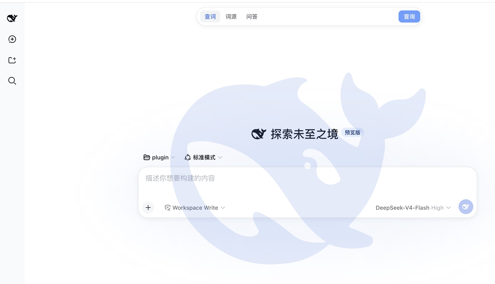

# dsh-english-search

在 [DeepSeek Harness](https://github.com/deepseek-ai)（DSH）输入框上方提供 [vocabtool.com](https://vocabtool.com) 风格搜索框的插件：**查词 / 词源 / 问答**三种模式，查词由 DSH 自身的 LLM 服务完成——不访问任何外部站点、不需要数据库、不需要本地后端。



## 功能

- 显示在输入框卡片上方的搜索栏，使用 DSH WebUI 原生设计令牌（`--dsw-alias-*`），与输入框卡片同表面、同描边、同圆角、同阴影：查词/词源/问答文字切换 + 紧凑原生「查询」小胶囊，明暗主题自动跟随，无玻璃拟态、无渐变按钮；搜索栏宽度收窄为 520px（`--es-bar-max-width`）
- 使用 DSH `conversation.input.dock` 官方插槽，兼容 DSH 0.1.0-rc.6 及保留该插槽的后续版本
- 三种模式：查词 / 词源 / 问答（输入框无内置占位提示文案）
- 快捷前缀：`!arena` 直接词源、`?lie 和 lay 的区别` 直接问答
- 结果面板样式与落地页一致（loading / error / 同款结果卡片 + 关闭按钮），内容渲染 Markdown（加粗 / 列表 / 标题 / 引用 / 行内代码）
- 查词走 DSH 当前会话默认模型（`agentDefaultModel`），与对话共用模型配额

## 架构

```
浏览器 (Client)                            DSH Host
┌──────────────────────────┐  fetch   ┌──────────────────────────┐
│ conversation.input.dock   │ ───────► │ webServer 路由            │
│ 输入框上方搜索栏           │ POST     │ /api/plugins/english-search│
│ React + 手写 bundle      │  ◄────── │  → ctx.llm.stream()       │
└──────────────────────────┘  JSON    │  (当前默认模型, effort=off │
                                      │   失败自动回退无 effort)   │
                                      └──────────────────────────┘
```

- **Host**（[`lib/index.js`](lib/index.js)）：注册 `webServer` 路由，经 `ctx.get('llm')` + `ctx.get('agentDefaultModel')` 调用 DSH 模型；三套系统提示词与 vocabtool.com 后端一致（源自 MIT 项目 [kami-mura/vocabtool-web](https://github.com/kami-mura/vocabtool-web)）
- **Client**（[`lib/client.js`](lib/client.js)）：手写 CJS bundle（与 tsdown `clientBundle` 产物同格式：`window.__ModuleLoader__.load({ id, factory })`），注册在 `conversation.input.dock` 插槽（id `english-search`），显示在输入框卡片上方；同源 fetch 调用 Host 路由；样式全部使用 DSH WebUI 设计令牌（`--dsw-alias-*` / `--dsw-specific-input-major` / `--dsw-shadow-lv2` / `--dsw-font-family`）并复用 `--dsh-composer-*` 宽度轴，与输入框卡片视觉一致、明暗主题自动跟随
- 无外部 HTTP 调用、无 Cookie、无数据库、无本地服务、无构建步骤

## 安装（原生插件，永久生效）

```bash
dsh plugin --profile web add dsh-english-search
```

该包是标准 dsh bundle（`dsh.bundle.patch`），`dsh plugin add` 会自动把它加入
profile 的层栈（`dsh.profile.bundles`），无需手改任何配置文件。安装后必须
**重启 dsh web 服务**才会生效。

从 GitHub 安装：

```bash
dsh plugin --profile web add github:kami-mura/dsh-English-search
```

卸载：

```bash
dsh plugin --profile web remove dsh-english-search
```

> 依赖 DSH 运行时能力：Host `llm` / `agentDefaultModel` / `webServer` 服务；Client `slots` 服务与 `react` 平台模块（DSH 内置）。包名 `dsh-english-search`（npm 命名规范，全小写）。

## 安装（动态插件，快速体验）

不安装部署时，也可在任意 DSH 会话中通过 `cordis_define` 动态运行：

1. `cordis_define`：`plugin.kind: "new"`，`idPrefix: "vocab"`
   - `code.host` ← 粘贴 [`plugin.host.js`](plugin.host.js)
   - `code.client` ← 粘贴 [`plugin.client.js`](plugin.client.js)
2. `cordis_run` 激活（Client 包首次需批准一次）

## 文件

| 文件 | 说明 |
| --- | --- |
| `lib/index.js` | 原生包 Host 半体（webServer 路由 + LLM 调用） |
| `lib/client.js` | 原生包 Client bundle（手写，vocabtool 同款搜索栏 UI） |
| `package.json` | 包声明（`dsh.client.platform: "web"`） |
| `plugin.host.js` / `plugin.client.js` | 动态插件快速安装版（同一套逻辑） |

## License

[MIT](LICENSE)
